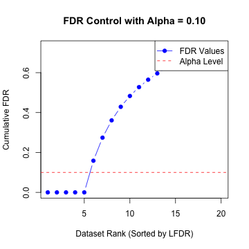

---
output:
  rmarkdown::github_document:
---

<!-- README.md is generated from README.Rmd. Please edit that file -->


# fashr

<!-- badges: start -->
<!-- badges: end -->

The goal of fashr is to implement the functional adaptive shrinkage through empirical Bayes.

**Note:** The code to generate the results for the manuscript is [here](https://github.com/stephenslab/fashr-paper).

## Installation

You can install the development version of fashr from [GitHub](https://github.com/) with:


``` r
# install.packages("pak")
pak::pak("stephenslab/fashr")
#> Error in loadNamespace(x): there is no package called 'pak'
```

## Example

This is a basic example, which tries to identify non-linear functions in a set of datasets.
We use `order = 2` to apply the second order IWP, which has a base model S<sub>0</sub> being the space of linear functions.


``` r
library(fashr)

# Simulate five datasets
set.seed(123)
datasets <- list()
for (i in 1:20) {
  n <- 50
  t <- seq(0, 5, length.out = n)
  sd <- sample(c(2, 1), size = n, replace = TRUE)
  u <- runif(1); if (u < 0.5) {f <- function(t) 3*cos(t)} else {f <- function(t) (t)}
  y <- f(t) + rnorm(n, sd = 0.5)
  datasets[[i]] <- data.frame(t = t, y = y, sd = sd)
}

# Fit the model
fash_fit <- fash(Y = "y", smooth_var = "t", S = "sd", data = datasets, 
                  order = 2, likelihood = "gaussian", verbose = TRUE)
```


``` r
fash_fit
#> Fitted fash Object
#> -------------------
#> Number of datasets: 20
#> Likelihood: gaussian
#> Number of PSD grid values: 25 (initial), 2 (non-trivial)
#> Order of Integrated Wiener Process (IWP): 2
```

Take a look at the structure plot ordered by local false discovery rate:


``` r
plot(fash_fit, ordering = "lfdr")
```

<div class="figure">

<p class="caption">plot of chunk unnamed-chunk-4</p>
</div>

Obtain the posterior summary of the function for the first dataset:


``` r
fitted <- predict(fash_fit, index = 1)
str(fitted)
#> 'data.frame':	50 obs. of  5 variables:
#>  $ x     : num  0 0.102 0.204 0.306 0.408 ...
#>  $ mean  : num  3.43 3.2 2.98 2.75 2.52 ...
#>  $ median: num  3.43 3.2 2.98 2.75 2.53 ...
#>  $ lower : num  1.96 1.94 1.89 1.8 1.67 ...
#>  $ upper : num  4.88 4.44 4.04 3.68 3.36 ...
```

Obtain the posterior samples of the function:


``` r
fitted_samps <- predict(fash_fit, index = 1, only.samples = TRUE, M = 30)
str(fitted_samps)
#>  num [1:50, 1:30] 3.36 3.13 2.96 2.78 2.57 ...
```

Visualize the predictions for the first dataset together with the data:


``` r
plot(datasets[[1]]$t, datasets[[1]]$y, type = "p", col = "black", ylab = "y", xlab = "t")
lines(fitted$x, fitted$mean, col = "red")
polygon(c(fitted$x, rev(fitted$x)), c(fitted$lower, rev(fitted$upper)), col = rgb(1, 0, 0, 0.2), border = NA)
matlines(fitted$x, fitted_samps[, 1:5], col = "blue", lty = 2, lwd = 0.5)
```

<div class="figure">

<p class="caption">plot of chunk unnamed-chunk-7</p>
</div>

Compute the FDR, and highlight the datasets with FDR < 0.1:


``` r
fdr_result <- fdr_control(fash_fit, alpha = 0.1, plot = TRUE)
#> 5 datasets are significant at alpha level 0.10. Total datasets tested: 20.
```

<div class="figure">

<p class="caption">plot of chunk unnamed-chunk-8</p>
</div>


``` r
fdr_result
#> $fdr_results
#>            index       FDR
#> Dataset_4      4 3.492e-16
#> Dataset_13    13 4.283e-16
#> Dataset_17    17 7.280e-12
#> Dataset_12    12 3.224e-11
#> Dataset_1      1 3.988e-09
#> Dataset_15    15 1.586e-01
#> Dataset_9      9 2.741e-01
#> Dataset_3      3 3.609e-01
#> Dataset_20    20 4.288e-01
#> Dataset_14    14 4.831e-01
#> Dataset_5      5 5.275e-01
#> Dataset_19    19 5.648e-01
#> Dataset_11    11 5.963e-01
#> Dataset_10    10 6.234e-01
#> Dataset_6      6 6.470e-01
#> Dataset_18    18 6.677e-01
#> Dataset_8      8 6.860e-01
#> Dataset_2      2 7.023e-01
#> Dataset_7      7 7.170e-01
#> Dataset_16    16 7.303e-01
```
